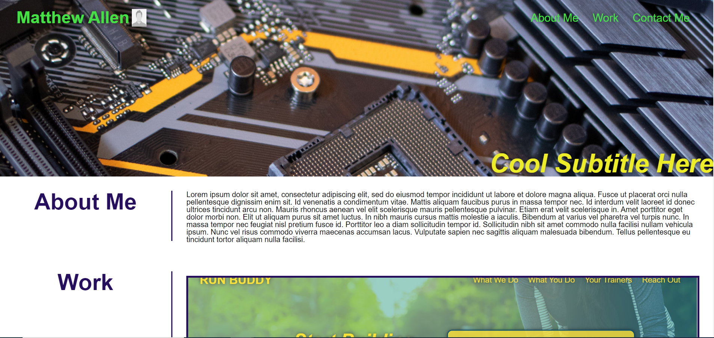

# Portfolio

## Purpose
Portfolio to showcase projects that I have worked on. 

## Features
* Clickable project cards with links to deployed projects
* Elements should rearrange to be more readable on smaller screens, using media queries
* Header element contains nav with links to main sections of the page
* Contact links

## Built with
* HTML
* CSS

## Website 
https://matt11711.github.io/My-portfolio-2022/

## Contribution
Made with ❤️ by Matt11711

